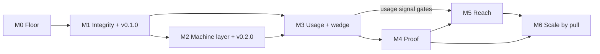

# Delivery Roadmap (Expanded): From Audited Prototype to Reference Implementation

- **Date:** 2026-07-10
- **Basis:** [AUDIT_REPORT.md](AUDIT_REPORT.md) (49 findings, 19 adversarially verified) and its section 5 roadmap, expanded here into milestones, work packages, acceptance criteria, and dependencies
- **Status:** proposal for maintainer ratification (recommend recording the adopted version as an ADR)
- **Companions:** [11_resources-and-sustainability.md](11_resources-and-sustainability.md) (who/what/how much), [12_catalog-recommendations.md](12_catalog-recommendations.md) (what to build next), [13_excellence-and-innovation.md](13_excellence-and-innovation.md) (differentiation plays), [specs/](specs/) (build specs referenced by work packages)

---

## 1. Sequencing thesis

**Floor, then wedge, then proof, then reach.** Every deep investment (evals, MCP, more bundles) is discounted while a fresh clone disproves the front-door claims in five minutes. The floor (license, CI, tag, truthful plan) costs about one day and makes the claims true. The wedge (LP-2 grade-my-doc) needs only the four existing bundles and produces the first real usage signal. Proof (EV-1 efficacy evals) then measures something real instead of authored examples. Reach (LP-1 fill flow, AG-2 MCP, marketplace) amplifies whatever exists, so it goes last, where it multiplies a proven thing instead of zero.

This ordering was adversarially stress-tested during the audit (finding G-03, roadmap sequencing, CONFIRMED): the repo's published 80/20 (evals, usage loop, MCP first) is internally contradicted by its own YAGNI risk section, and both are pre-empted by the credibility floor. Three rules keep this roadmap honest where the old plan went stale:

1. **The plan is subordinate to reality.** A STATE block (see WP-04) is updated in the same commit as any milestone exit. A roadmap that says "Not started" while the tree says otherwise is a defect (this is what audit finding G-01, stale plan, was).
2. **Decision SLA.** Any open decision with a stated resolution cost under 2 hours is resolved within 3 working days or explicitly re-dated with a reason (audit finding E-05, decision triage).
3. **Marketing tense discipline.** Present tense only for what exists; roadmap tense for the rest (the root cause behind audit findings G-02, F-05, and C-01's marketing gap).

**Baseline assumption:** solo maintainer at roughly 10 to 15 focused hours per week, heavily agent-leveraged (see the resources doc). Calendar durations below assume that; compress or stretch proportionally.

---

## 2. Milestone overview

| Milestone | Goal | Duration (est.) | Exit act | Closes (primary) |
|---|---|---|---|---|
| M0 Credibility floor | A fresh clone survives the five-minute sniff test | 1 day | CI green on main | E-01, D-03, G-01, F-03, B-04, C-05, B-08, F-07 |
| M1 Integrity and truth | Content claims verifiable; decisions closed; first release | 1 week | Tag v0.1.0 with a dogfooded release note | A-01..A-06, D-02, E-03 (D2), D3, F-01, F-05, G-02 |
| M2 Machine layer, contract, graduation | The library is machine-consumable and lives at its final path | 2 weeks | Tag v0.2.0 | B-01, B-02, C-03, C-04, C-06, C-08, C-09, E-06, E-07 done at M1, F-02, F-06, G-04 |
| M3 First usage and wedge | One real usage cycle; LP-2 shipped; demand capture live | 1-2 weeks (overlaps M2 tail) | First external doc graded + EV-3 form banked | D-05, E-04 partial, E-02 partial |
| M4 Proof | Quality measured, not asserted; regression-protected | 2 weeks | Per-bundle eval scorecards published | D-04, EV-2, CT-1 (conditional) |
| M5 Reach | Agents can discover, select, fetch, fill, validate | 4-6 weeks, gated on M3 signal | MCP + fill flow live; distribution per D2/D3 outcomes | C-01, E-02 remainder, AG-1, AG-2 |
| M6 Scale by pull | Next family by demand; sustainable cadence | ongoing | Quarterly freshness pass #1 completed | E-04, G-05, VL-1/VL-3 |

Dependency spine:



---

## 3. Work packages

Effort: S = under 1 hour, M = roughly half a day, L = one or more days. Traces: audit finding IDs and specs.

### M0: Credibility floor (1 day total)

| WP | Work package | Deliverables | Effort | Traces |
|---|---|---|---|---|
| WP-01 | License grant | `LICENSE` (Apache-2.0, copied from `pm-skills/LICENSE`) at repo root | S | E-01 |
| WP-02 | CI bridge | `.github/workflows/ci.yml` running `python _local/tools/check-bundles.py` on push and PR (snippet in AUDIT_REPORT.md finding D-03) | S | D-03, G-02 |
| WP-03 | Hygiene sweep | Delete `_local/templates/_working/`; fill `maintainer`/`owner` placeholders in 4 metas + methodology; relabel dangling `related_templates` entries with `future:` prefix; sweep bare P1/P3 IDs in plan and gate docstring | S | B-08, C-05, B-05, F-07 |
| WP-04 | Truth infrastructure | Plan progress table updated to actual; dated Revisions row recording the content-first re-sequencing; `STATE.md` at root (10 lines: built vs planned, counts, gate status, last-updated); superseded banner atop the design spec | S/M | G-01, G-04 |
| WP-05 | Decision records | `docs/decisions/` with MADR TEMPLATE.md plus 7 transcribed ADRs (4 foundational from 2026-06-29; guidance style; research log as 8th file; Python/local gate as interim) | M | F-03, G-06 |
| WP-06 | Rulebook consistency | methodology.md "seven files" corrected to eight in both places + research-log row added to the section 2 table + drafting step added | S | B-04, C-07, F-04 |

**M0 acceptance criteria**
- [ ] `git ls-files` shows LICENSE, STATE.md, `.github/workflows/ci.yml`, `docs/decisions/` with 8 files.
- [ ] CI run visible and green on GitHub for the merge commit.
- [ ] `python _local/tools/check-bundles.py` still exits 0.
- [ ] Grep for `{{maintainer}}` and `{{owner}}` returns only template-variant placeholder lines (none in metas or governance frontmatter).
- [ ] The plan's Completion Status table matches the tree (spot-check P4 marked done with commit evidence).

### M1: Integrity and truth (week 1)

| WP | Work package | Deliverables | Effort | Traces |
|---|---|---|---|---|
| WP-10 | Citation integrity pass | SVPG entries gain retrieval qualifiers; Ranorex claim re-sourced or labeled author judgment; Keep a Changelog corrected to 1.1.2 with root URL; PRD refs 8 and 12 cited or removed, ref 12 retagged; Lenny quote de-quoted to paraphrase or verified via subscription; combined entries split; methodology section 6 gains the blocked/paywalled-source convention and the book/pre-web format rule | M | A-01..A-06, B-03 |
| WP-11 | Gate hardening v1 | check-bundles.py adds: reverse citation direction (padded entries fail); meta placeholder scan; history entry for current template_version; `pairs_with` resolution against a pinned skill-ID list; `related_templates` resolution against local bundles + `future:` convention; heading check extended to (level, text) tuples | M | D-02, D-01 partial, D-06, B-05 |
| WP-12 | Decision closure | D2 skills-CLI install test run and recorded (30 min); D3 agentskills.io spec read and recorded (1 h); both closed in the plan with dated outcomes; decision SLA rule written into CONTRIBUTING (or STATE.md until it exists) | M | E-03, E-05 |
| WP-13 | Consumer quickstart | README gains "Quick start: use a template" (6 literal steps); README claim reconciliation ("enforceable" scoped to what CI now actually runs; "complete/verified" aligned with beta status) | M | F-01, F-05, G-02 |
| WP-14 | Release v0.1.0 | CHANGELOG.md with [0.1.0] section; git tag v0.1.0; release notes written **using the library's own release-notes lean template** (first dogfood artifact) | S | E-07, dogfood play (13_excellence section 3) |

**M1 acceptance criteria**
- [ ] Extended gate exits 0 on all four bundles and would fail a synthetic padded-entry fixture (keep the fixture test in the tools folder).
- [ ] No companion asserts an unqualified access date for a source the research log marks as blocked or excerpt-only.
- [ ] D2 and D3 rows in the plan read Resolved with date and one-paragraph outcome.
- [ ] A newcomer following only the README quickstart can produce a filled lean PRD (test this literally with one person or one agent run).
- [ ] `git tag` lists v0.1.0; the GitHub release body is the filled release-notes template with provenance frontmatter.

### M2: Machine layer, contract, graduation (weeks 2-3)

Ordering note: graduation (WP-20) runs FIRST so every machine surface (schema, manifest, MCP later) is built against final paths, not `_local/` paths that would need re-stamping.

| WP | Work package | Deliverables | Effort | Traces / spec |
|---|---|---|---|---|
| WP-20 | HY-2 decision + graduation | ADR deciding the final scaffold (recommended: flat `templates/<type>/`); migration checklist executed as one atomic commit (README links, methodology applies_to, gate TEMPLATES_DIR, session/audit docs get a pointer note); redirect note left in `_local/` | M | E-06, HY-2 |
| WP-21 | Metadata schema | `tools/meta.schema.json`; gate check G validates every meta against it | M | B-02; [specs/spec_machine-metadata.md](specs/spec_machine-metadata.md) |
| WP-22 | Machine catalog | `manifest.json` generated at root (script `tools/gen-manifest.py`); count-consistency check (README count == manifest count == bundle dirs) | M | C-03; machine-metadata spec |
| WP-23 | Selection metadata | `sizing_guidance`, `default_size`, generated `approx_tokens` map per meta; regenerate manifest | S/M | C-04, C-06; machine-metadata spec |
| WP-24 | Family contract | `_families/delivery-docs.contract.md` (modeled on the pm-skills meeting-skills contract); gate family check | M | B-01 |
| WP-25 | Fill tooling | `tools/strip-template.py` (strip comments, stamp fill_date); `filled_by`/`fill_method` placeholder fields added to all variants | S/M | C-09, C-08; LP-1 spec section 4 |
| WP-26 | Freshness automation v1 | lychee (or equivalent) link-check over all tracked markdown in the same CI workflow; research logs gain `fetch_status` column; failure policy: dead link fails CI, paywall/403 requires qualifier | M | A-03 systemic, G-05, FR-1 |
| WP-27 | Docs tree | CONTRIBUTING.md; `docs/contributing/authoring-contract.md` (composed reference index); `docs/reference/gate-checks.md` and `metadata-schema.md`; README split so consumer content leads and contributor content moves out (target under 120 lines) | L | F-02, F-06; AUDIT_REPORT section 7 tree |
| WP-28 | Release v0.2.0 | CHANGELOG [0.2.0]; tag; release note dogfooded again. v0.2.0 semantics: the delivery-docs family complete WITH its rails (contract + validator), matching the original plan's AC-14 intent | S | E-07 lineage, plan AC-12/AC-14 |

**M2 acceptance criteria**
- [ ] `templates/` is the canonical path; zero content references to `_local/templates/` remain outside historical docs (grep-verified); gate runs from the new path.
- [ ] `python tools/check-bundles.py` now reports checks A through J (or however lettered) including schema, family, pairs_with, related_templates, link-status summary.
- [ ] `manifest.json` validates against its own schema, lists 4 bundles, and regeneration is idempotent.
- [ ] An agent given only manifest.json can answer: which bundle for each of the 3 audit test intents, which size by default, and what each fetch costs in approx tokens (re-run the Dimension C simulation; all 6 of 6 decisions should now be deterministic).
- [ ] CI fails on a deliberately broken fixture for: schema violation, padded citation, dead link (test once, then remove fixtures).

### M3: First usage and wedge (weeks 3-4, overlapping M2 tail)

| WP | Work package | Deliverables | Effort | Traces / spec |
|---|---|---|---|---|
| WP-30 | LP-2 grade-my-doc | `skills/grade-doc/SKILL.md` + rubric extraction per spec; report-card output format; works on all 4 bundles | L | D-05 path, E-04; [specs/spec_lp2-grade-my-doc.md](specs/spec_lp2-grade-my-doc.md) |
| WP-31 | First real usage cycle | One real internal document filled from the lean PRD (or user-stories) template; EV-3 five-question feedback form designed and completed; outcome recorded in the bundle history | M | D-05, EV-3 |
| WP-32 | Demand capture | GitHub issue form as the pull queue (structured fields: requested type, requester context, methodology, urgency); atlas `catalog-data.json` gains a per-type `state` field (built / queued / pull-gated / out-of-scope) with an atlas legend | M | E-04, P7, VS-3; [12_catalog-recommendations.md](12_catalog-recommendations.md) section 5 |
| WP-33 | Wedge outreach | LP-2 run against 3 to 5 real documents from real PMs (network, community); each produces a report card and an EV-3 form | M | D-05, E-04 |

**M3 acceptance criteria**
- [ ] At least one filled document exists whose author is not the library author, or whose content is a real work artifact (not an authored example); its provenance frontmatter is stamped and its EV-3 form is stored.
- [ ] LP-2 grades a never-seen PRD in under 3 minutes of wall-clock agent time and its report card cites specific rubric line items.
- [ ] The pull queue has at least one genuine external entry OR a documented outreach log showing five attempts.
- [ ] Because LP-2 ships as a SKILL.md in this repo, the D2 question is retested with the skill present: record whether `npx skills add product-on-purpose/product-lifecycle-templates` now installs (this is the distribution unlock the audit predicted).

### M4: Proof (weeks 5-6)

| WP | Work package | Deliverables | Effort | Traces / spec |
|---|---|---|---|---|
| WP-40 | EV-1 efficacy evals | `evals/` with 12 scenarios (3 per bundle); with-template vs freehand arms; 3-judge blind rubric panel; baseline discrimination gap recorded per bundle | L | D-04; [specs/spec_ev1-efficacy-evals.md](specs/spec_ev1-efficacy-evals.md) |
| WP-41 | Quality scorecard | EV-2 scorecard fields in meta (research depth, citation mix, freshness, eval gap); badge line in each bundle landing and README table | M | EV-2, 13_excellence play 1 |
| WP-42 | Conformance levels | Gate reports L1 (structure) / L2 (research integrity) / L3 (eval-proven) per bundle; levels shown in manifest and atlas | M | 13_excellence play 4 |
| WP-43 | Second-domain example (conditional on usage signal) | One bundle (recommended: PRD) gains a second worked example from a different domain (regulated/health or consumer-mobile) plus a lean-variant example | L | CT-1, A dimension validity limit |

**M4 acceptance criteria**
- [ ] Every bundle has a published eval scorecard with a with-vs-without discrimination gap and a judge-agreement stat.
- [ ] CI re-runs the eval subset affected by any template/companion change and fails on a gap regression beyond the set threshold.
- [ ] The README quality claim now links to numbers ("measured, not asserted").

### M5: Reach (quarter horizon; gated on M3 usage signal)

| WP | Work package | Deliverables | Effort | Traces / spec |
|---|---|---|---|---|
| WP-50 | LP-1 use-template flow | Interview-driven fill (skill first, CLI later) reusing ASK lines; stamps provenance; strips guidance; runs validation | L | C-01; [specs/spec_lp1-use-template-flow.md](specs/spec_lp1-use-template-flow.md) |
| WP-51 | AG-2 MCP server | `product-lifecycle-templates-mcp` per spec: list/select/fetch/grade/fill tools, bundle-summary resources, token-budgeted responses | L+ | C-01 follow-on; [specs/spec_ag2-mcp-server.md](specs/spec_ag2-mcp-server.md) |
| WP-52 | Distribution wiring | Per D2/D3 outcomes: `.claude-plugin/plugin.json`, marketplace entry, AGENTS.md; ZIP release artifact | M | E-02 remainder |
| WP-53 | AG-1 section schema | Generated per-bundle section schema (required/optional, tables, columns) consumed by LP-1/LP-2 validation | M | AG-1; machine-metadata spec section 6 |
| WP-54 | VL-1 positioning executed | Business-model ADR (recommended default: free and open, funnel for product-on-purpose, per VL-2); public README positioning updated accordingly | S | E-04, VL-1 |

**M5 acceptance criteria**
- [ ] An agent with only the MCP server configured completes: intent to bundle+size selection, fetch, fill, validation, provenance-stamped output, with zero human file navigation.
- [ ] Install paths documented and tested: git, ZIP, skills CLI (per D2 outcome), plugin (per spec), MCP.
- [ ] Token budget respected: default MCP responses under 1,200 tokens; companion served only on explicit request.

### M6: Scale by pull (ongoing cadence)

| WP | Work package | Deliverables | Traces |
|---|---|---|---|
| WP-60 | Next family (when pulled) | Per [12_catalog-recommendations.md](12_catalog-recommendations.md): decision-docs family (adr, design-doc, rfc, spike-summary), with the ADR bundle first (internal dogfood demand already exists) | 12_catalog sections 3-4 |
| WP-61 | Maintenance cadence (VL-3) | ADR: quarterly freshness pass (re-verify flagged sources, refresh approx_tokens, re-run evals), monthly decision triage; calendar entries created | G-05, E-04 |
| WP-62 | Contribution pipeline | CONTRIBUTING grows a bundle-proposal path (issue form to draft-by-agent to human review against DoD); AG-3 authoring kit formalized | E-04, AG-3 |
| WP-63 | Tier-2/Tier-3 gates | Tier-2 methodology packs only on active-practice pull; Tier-3 regulated module only after D4 decision, with QMSR-current verification discipline | D4, catalog Rec 2-3 |

---

## 4. Timeline view (assumes ~12 h/week)

```
Week 1   [M0 floor: 1 day][M1 integrity, gate v1, D2/D3, quickstart]  -> tag v0.1.0
Week 2   [M2: graduation, schema, manifest]
Week 3   [M2: family contract, docs tree, freshness CI] [M3: LP-2 build starts]
Week 4   [M3: LP-2 ships, first real fill, pull queue, outreach]      -> tag v0.2.0
Week 5   [M4: EV-1 scenarios + baseline]
Week 6   [M4: scorecards, conformance levels]                          -> eval numbers published
Weeks 7+ [M5 gated on usage signal: LP-1, MCP, distribution, VL-1]
Ongoing  [M6: pull-gated families, quarterly freshness, contribution]
```

---

## 5. Explicit non-goals (deferred by decision, not by neglect)

| Deferred item | Why | Re-open trigger |
|---|---|---|
| Layer 1 generator (D1) | Decision gate unanswered: one-time vs recurring customization | Two or more families shipped AND a real org customization request |
| Tier-3 regulated packs (D4) | Blank-but-wrong regulated templates are worse than none; QMSR currency burden | Explicit appetite decision + a regulated-domain user |
| Coverage-first breadth | Named "the seductive wrong answer" in the strategy brief; still true | Never (pull-gated forever) |
| Multi-language variants, audience rendering | Original design spec deferral stands | Real demand via pull queue |
| Decoupling pm-skills bundled templates | Additive posture decided in design spec section 4 | Maintenance pain from duplication, evidenced |

---

## 6. Risks to this roadmap

| Risk | Signal | Mitigation |
|---|---|---|
| Floor skipped again in favor of interesting work | M0 not done within a week of ratifying this doc | M0 is one day; do it before opening any spec |
| Wedge outreach stalls (no real users found) | WP-33 log shows under 5 attempts by end of week 4 | Treat outreach as a work package with acceptance criteria, not a hope; the EV-3 form makes each contact cheap |
| Eval cost/complexity balloons | WP-40 exceeds ~2 days | Scope guard: 12 scenarios, 3 judges, one metric (discrimination gap); everything else is later |
| Graduation breaks links | Post-WP-20 grep finds stragglers | The migration checklist IS the WP; atomic commit; CI link-check catches leftovers |
| Roadmap goes stale like the plan did | STATE.md older than the last tag | STATE update is part of every milestone exit AC |

---

## 7. Traceability

Every audit High/Critical finding maps to a work package: E-01 to WP-01; F-01 to WP-13; G-02 to WP-02/WP-13; D-05 to WP-31/WP-33; B-02 to WP-21; G-01 to WP-04; A-01/A-02 to WP-10; E-02 to WP-02/WP-52; C-01 to WP-50/WP-51; D-01 to WP-11; D-04 to WP-40; E-03 to WP-12; E-04 to WP-32/WP-61/WP-62; G-03 is this document's ordering; F-03 to WP-05; B-01 to WP-24; F-02 to WP-27. Medium/Low findings map per the tables above.
