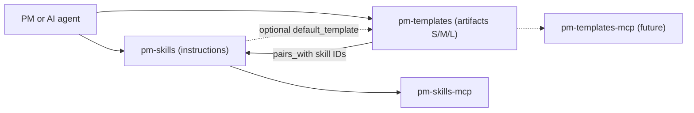

# Template Library: Concept, Architecture and Specification

> **[SUPERSEDED IN PART. Read this before trusting anything below.]**
>
> This is the founding design document, written 2026-06-28 and preserved as the record of the original architecture. Several of its specifics were overturned by decisions taken during the build. Where it disagrees with the records in [`docs/decisions/`](../../../docs/decisions/), **the decision records win**; where it disagrees with the tree, [`STATE.md`](../../../STATE.md) wins.
>
> Known supersessions:
>
> | This document says | Actual decision |
> |---|---|
> | The name is `pm-templates` (working name, used throughout below) | `product-lifecycle-templates` everywhere, `pm-` prefix dropped. [ADR 20260629](../../../docs/decisions/20260629-repo-and-package-name.md) |
> | Rigid S/M/L variants with abstract filenames (`template.s.md`) | lean/full with descriptive filenames; three weights only where a type earns them; the strict nesting rule is retained in full force. [ADR 20260629](../../../docs/decisions/20260629-variant-model.md) |
> | `phase: Deliver` (capitalized) | Lowercase phase values, matching real pm-skills frontmatter. [ADR 20260629](../../../docs/decisions/20260629-phase-vocabulary.md) |
> | Bundle IDs of the form `deliver-prd` | Bare doc-type handles (`prd`); phase lives in metadata, never in the path or ID. [ADR 20260630](../../../docs/decisions/20260630-bundle-ids-doctype-spine.md) |
> | A six-file bundle | Eight files; the research log is a shipped artifact. [ADR 20260630](../../../docs/decisions/20260630-research-log-as-8th-file.md) |
>
> The `{{owner}}`-style placeholders in the schema examples below are intentional: this document *defines* the instance-frontmatter contract, so its examples show the placeholders rather than filled values.
>
> **Working name (historical):** `pm-templates`. This document uses it throughout. Read it as `product-lifecycle-templates`.
>
> **One-line positioning:** `pm-skills` teaches an agent *how to produce* a PM artifact. `pm-templates` provides *the artifact itself* as a multi-variant, self-describing markdown shape. They are siblings in the same marketplace, joined by an explicit metadata bridge.

---

## 1. Overview

`pm-templates` is a standalone, local-first, file-based library of markdown document templates for product and software work. Every document type ships not as a single file but as a **bundle** with multiple size variants (small, medium, large), a worked example, a usage guide, and a machine-readable manifest. The library is built to the same conventions, distribution rails, and taxonomy as [`pm-skills`](https://github.com/product-on-purpose/pm-skills), so the two interoperate without either one depending on the other.

The design goal is not "a folder of templates." It is the indisputable best-in-class reference implementation of a template library: rigorous metadata, CI-enforced quality contracts, agent-and-human dual readability, and zero ambiguity about what each artifact is and when to use it.

---

## 2. The Problem

Templates today, including those inside `pm-skills`, have four structural limitations:

1. **They are bundled, not addressable.** In `pm-skills`, each template lives at `skills/{phase-skill}/references/TEMPLATE.md`. It is owned by one skill, not independently discoverable, installable, or versionable on its own.
2. **They are single-variant.** One PRD template serves a napkin-stage spike and a multi-quarter platform initiative equally poorly. Context-appropriate sizing does not exist.
3. **They carry no self-description.** A raw `TEMPLATE.md` cannot tell a human or an agent what it is, what stage it serves, what methodology it follows, or which skill produced it.
4. **They have no provenance.** Once a template is copied and filled, nothing links the resulting document back to the template and version it came from. Drift is invisible.

The broader open-source landscape does not solve this either. Curated lists (for example [`dend/awesome-product-management`](https://github.com/dend/awesome-product-management), [`lorabv/awesome-agile`](https://github.com/lorabv/awesome-agile)) point outward to scattered resources. The genuinely high-quality "fillable templates for every document type and every size, in one governed repo" does not exist as a single artifact. That is the gap.

---

## 3. Vision and Value Proposition

**Vision:** the canonical template library that both humans and agents reach for first, because every artifact in it is unambiguous, sized to context, traceable, and quality-gated.

**Value pillars:**

| Pillar | What it delivers |
|---|---|
| **Context-fit sizing** | S/M/L variants mean the right amount of structure for the situation, not a one-size template that gets gutted or padded every time. |
| **Self-describing artifacts** | Every bundle declares what it is, what stage it serves, and what it pairs with. Discovery and selection become deterministic. |
| **Provenance and traceability** | A filled document carries a stamp back to its source template and version. You can answer "which live docs run on a deprecated template." |
| **Agent-native** | Consistent skeletons, machine-readable manifests, and a stable placeholder convention make the library directly consumable by AI agents, not just humans. |
| **Ecosystem coherence** | Same conventions, taxonomy, and rails as `pm-skills`, so adopting one lowers the cost of adopting the other. |
| **Quality you can trust** | A CI-enforced Definition of Done means there are no half-finished or undocumented templates in the set. |

**Who benefits:** individual PMs and engineers (faster, more consistent docs), teams (a shared institutional standard), and AI agents (a clean, structured resource to fill).

---

## 4. Positioning in the Product-on-Purpose Ecosystem

The relationship to `pm-skills` is the single most important design constraint, so it is stated explicitly.

- `pm-skills` = **instructions** (how to produce an artifact). Skills remain self-contained and keep their own bundled default `TEMPLATE.md`.
- `pm-templates` = **artifacts** (the blank shapes, in S/M/L, with richer metadata than a bundled template can carry).
- The relationship is **additive and non-breaking.** `pm-templates` *supersets* what skills carry. Nothing in `pm-skills` has to change for `pm-templates` to be useful. A skill *may optionally* point at the richer template set, but is never required to.



**The self-containment tension, resolved.** `pm-skills` advertises skills as self-contained, each carrying its own template. If `pm-templates` "owns" templates, there are two paths:

- **Additive (adopted).** Skills keep their bundled default. `pm-templates` provides expanded and variant templates. No breakage, offline use intact, fully reversible.
- **Decoupled (rejected for now).** Refactor skills to reference shared templates by URI. More DRY, but it breaks self-containment and the clean ZIP/offline story. Revisit only if duplication becomes a real maintenance burden.

---

## 5. Core Design Principles

1. **Local-first and file-based.** Plain markdown and YAML. No database, no service dependency, no build step required to *use* a template. An optional build step may *generate* artifacts (see [§6](#6-the-multi-variant-model-sml)).
2. **One spine, many lenses.** Document type is the directory spine. All other lenses (size, stage, methodology, audience) are expressed as metadata, never as a combinatorial explosion of folders.
3. **Single source of truth per document type.** A given document type has exactly one bundle. Variants are mechanisms within it, not divergent copies that drift.
4. **Self-describing.** Every bundle carries a machine-readable manifest. Nothing in the library is anonymous.
5. **Dual-readable.** Every artifact is clean for a human to read and structured enough for an agent to parse. Guidance lives in HTML comments that vanish on render.
6. **Composable and single-purpose.** Each bundle does one thing. Sections are reusable units where partials are used.
7. **Provenance by default.** Using a template stamps identity and version into the result.
8. **House style.** No emdash characters anywhere, enforced in CI, matching the org-wide standard.

---

## 6. The Multi-Variant Model (S/M/L)

The size lens is the headline feature. It is governed by one rule that prevents chaos.

**The nesting rule:** a Small is a strict subset of a Medium, which is a strict subset of a Large. Section identifiers are shared across sizes; larger variants add sections, they never rename or reorder shared ones. This gives an **upgrade-in-place** path: a document can grow from S to M to L as an initiative matures, without a re-author.

```
Small  : problem, success-metric, scope
Medium : problem, success-metric, scope, user-stories, risks
Large  : problem, success-metric, scope, user-stories, risks,
         dependencies, rollout, open-questions, appendix
```

**Two implementation mechanisms** (the choice is an open decision, see [§17](#17-open-decisions)):

- **Section-partial library + assembled variants.** Author each section once as a partial; S/M/L are different assemblies. Best for DRY and composability; costs a small build step.
- **One parametric master with conditional sections** marked by HTML comments and toggled by a `size` field. Best for zero build tooling and discoverability; costs a slightly noisier source file.

Recommendation: ship the MVP as a parametric master (no build dependency, fastest to stand up), and graduate to partials once the family grows enough that duplication hurts.

---

## 7. The Lens / Taxonomy Framework

Six lenses were evaluated. Only one becomes the directory spine; the rest become metadata axes.

| Lens | Role | Why |
|---|---|---|
| **Document type** | Directory spine | The stable, intuitive primary axis. |
| **Size (S/M/L)** | Within-bundle mechanism | The headline feature; handled by the nesting rule. |
| **Stage / phase** | Frontmatter axis (`phase`) | Reuses the `pm-skills` Triple Diamond axis: Discover, Define, Develop, Deliver, Measure, Iterate. This is a key compatibility seam. |
| **Methodology / provenance** | Frontmatter axis (`methodology`) | Some docs are school-specific (Nygard ADR, Amazon PR/FAQ, Shape Up pitch). Tag the lineage so users know the philosophy they adopt. |
| **Audience / view** | Section include/exclude | Exec vs engineering vs customer is usually the same content rendered for a different reader. Handle as sections, not separate templates. |
| **Team / context maturity** | Frontmatter flag | Solo vs large team, regulated vs not. Changes overhead, not document identity. |

The discipline: **materializing a lens as folders is forbidden unless it is the spine.** Size 3 x stage 5 x audience 3 would be 45 files per document type. Metadata keeps the library flat and queryable.

---

## 8. Repository Structure

The structure deliberately mirrors the `pm-skills` `references/` convention so linters and CI can be shared in spirit.

```
pm-templates/
├── templates/
│   └── deliver-prd/                  # one bundle per document type
│       ├── template.s.md             # Small variant (instance frontmatter + body)
│       ├── template.m.md             # Medium variant
│       ├── template.l.md             # Large variant
│       ├── example.md                # a real worked example, not lorem
│       ├── guide.md                  # when-to-use, quality bar, anti-patterns
│       └── template.meta.yaml        # catalog meta (the manifest)
├── _families/                        # template-family contracts (see §11)
│   └── delivery-docs.contract.md
├── docs/
│   ├── reference/                    # this spec, taxonomy, ecosystem notes
│   └── guides/                       # how-to: using and authoring templates
├── scripts/                          # lint + validate + generate (sh + ps1)
├── .github/                          # CI workflows
├── .claude-plugin/
│   └── plugin.json                   # Claude plugin manifest
├── AGENTS.md                         # universal agent discovery
├── catalog.md                        # generated index of all bundles
├── manifest.json                     # generated machine catalog
├── marketplace.json                  # marketplace entry (aligned to pm-skills)
├── CHANGELOG.md
├── CONTRIBUTING.md
├── LICENSE                           # Apache-2.0, matching pm-skills
└── README.md
```

**Bundle anatomy** is the atomic contract: three or more size variants, one example, one guide, one manifest. A directory missing any of these is invalid and fails CI.

---

## 9. Two-Tier Metadata Architecture

There are two distinct kinds of metadata, with different audiences and lifecycles, plus a thin bridge. Conflating them is the primary way template repos rot.

### 9.1 Catalog meta (the asset)

Lives in `template.meta.yaml`. Audience: the repo, CI, agents doing discovery. Describes the template *as a library asset*. **Never travels into a filled document.**

| Field | Example | Notes |
|---|---|---|
| `id` | `deliver-prd` | Matches the `pm-skills` skill-ID convention. |
| `title` | `Product Requirements Document` | |
| `summary` | `Comprehensive product requirements...` | One line. |
| `doc_type` | `prd` | |
| `phase` | `Deliver` | Triple Diamond axis; the taxonomy bridge. |
| `family` | `delivery-docs` | Optional; groups bundles under a contract. |
| `sizes_available` | `[s, m, l]` | Must match the variant files present. |
| `methodology` | `generic` | Or `nygard-adr`, `amazon-prfaq`, etc. |
| `pairs_with` | `[deliver-prd]` | **The compatibility seam.** Skill IDs this template serves. |
| `status` | `stable` | `stable` / `beta` / `deprecated`. |
| `template_version` | `1.2.0` | SemVer for the template asset. |
| `tags` | `[requirements, delivery]` | |
| `related_templates` | `[deliver-user-stories]` | |
| `maintainer` | `{{maintainer}}` | |
| `last_reviewed` | `2026-06-28` | |
| `license` | `Apache-2.0` | Matches the org. |

### 9.2 Instance meta (the document)

Lives as the YAML frontmatter inside each `template.{s,m,l}.md`, shipped with placeholder values. Audience: the author and readers of the resulting document.

| Field | Shipped value | Notes |
|---|---|---|
| `title` | `{{title}}` | |
| `doc_type` | `prd` | |
| `size` | `s` / `m` / `l` | Set per variant file. |
| `owner` | `{{owner}}` | |
| `status` | `draft` | `draft` / `in-review` / `approved`. |
| `doc_version` | `{{version}}` | SemVer for the *document*, distinct from `template_version`. |
| `created` | `{{date}}` | |
| `updated` | `{{date}}` | |
| `related_links` | `[]` | Tickets, docs. |
| `source_template` | `deliver-prd` | **Provenance bridge.** |
| `source_template_version` | `1.2.0` | **Provenance bridge.** |

### 9.3 The name-collision rule

`status` and `version` mean different things on a template versus a document. They are disambiguated by which file they live in *and* by name (`template_version` vs `doc_version`, `status` in catalog meta describes asset lifecycle, `status` in instance meta describes document review state). An agent must never confuse the two.

### 9.4 The provenance bridge

When a template is used, `source_template` and `source_template_version` are copied into the filled document's frontmatter. This is the only data that crosses from catalog into instance, and it is what makes a filled document traceable back to its origin.

---

## 10. Compatibility Contract with pm-skills

"Compatible" is four independent commitments. Each can be adopted on its own.

1. **Shared conventions.** Flat predictable layout, frontmatter-lint CI, Conventional Commits, SemVer, a HISTORY/CHANGELOG contract, `AGENTS.md` discovery, `marketplace.json` plus `.claude-plugin/plugin.json`, and the no-emdash sweep.
2. **Shared distribution rails.** Installable via the `skills` CLI / openskills, ZIP upload, and an optional MCP wrapper later, exactly as `pm-skills` and `pm-skills-mcp` are.
3. **Shared taxonomy.** Every bundle declares a `phase` on the Triple Diamond axis, so both repos speak one vocabulary.
4. **Cross-reference bridge.** `pairs_with` (template to skill) and, optionally and additively on the skill side, `default_template` / `expanded_templates` (skill to template). Linkage is by stable ID, never by path.

**Validation:** a CI check resolves every `pairs_with` entry against a pinned list of known `pm-skills` skill IDs (or accepts an explicit `null`). A template that claims to pair with a nonexistent skill fails the build.

---

## 11. Template Family Contract

This mirrors the `pm-skills` skill-family contract pattern (for example its meeting-skills contract) and is what elevates the repo from "a pile of templates" to "a governed system."

A **family** is a set of bundles that share a phase and purpose and agree to a common shape. The contract document (`_families/<family>.contract.md`) specifies:

- The shared section vocabulary the family draws from.
- The required catalog-meta fields and their allowed values for this family.
- The size-nesting expectation for members.
- The shareable-boundary rule (what is template body vs guidance vs example).

CI (`validate-template-family.sh` / `.ps1`) enforces conformance: filename convention, manifest schema, declared sizes present, example and guide present, and nesting integrity. The first family to ship (`delivery-docs`: PRD, user stories, acceptance criteria, release notes) establishes the pattern the rest of the repo follows.

---

## 12. Distribution and Installation

| Channel | Mechanism | Status |
|---|---|---|
| `skills` CLI | `npx skills add product-on-purpose/pm-templates` | Pending a test of CLI behavior with no `SKILL.md` (see [§17](#17-open-decisions)). |
| Git clone | `git clone ...` | Always works. |
| ZIP upload | Release artifact for Claude.ai / Desktop | Always works. |
| Claude plugin | `.claude-plugin/plugin.json` | Mirrors `pm-skills`. |
| MCP wrapper | `pm-templates-mcp` (future) | Parallels `pm-skills-mcp`. |

**The thin companion skill.** A pure template repo is not invokable the way a skill is, because the agent-skills spec expects a `SKILL.md` entry point. To make templates first-class in slash-command and agent surfaces, ship one small skill, `use-template`, whose job is: select the document type and size, fetch from the library, fill the template, and stamp provenance. This also gives the S/M/L selection logic a natural home. This skill could live here or in `pm-skills` as a foundation/utility skill.

---

## 13. Quality Bar / Definition of Done

This section is the heart of "best in class." A bundle is **done** only when every item holds. CI blocks merges otherwise.

- [ ] All declared size variants present, and section IDs nest correctly (S subset M subset L).
- [ ] `example.md` is a genuine worked example, not placeholder filler.
- [ ] `guide.md` includes when-to-use, a quality rubric, and named anti-patterns.
- [ ] `template.meta.yaml` passes schema lint.
- [ ] Placeholder convention is consistent (`{{snake_case}}`) across all variants.
- [ ] Guidance is in HTML comments and strips cleanly on render.
- [ ] Zero emdash characters (CI sweep).
- [ ] Valid YAML frontmatter on every variant.
- [ ] `pairs_with` resolves to known skill IDs or is explicitly `null`.
- [ ] A HISTORY entry exists for the current `template_version`.

**CI scripts** (named to match `pm-skills` style, shipped as `.sh` and `.ps1` pairs):
`lint-template-frontmatter`, `validate-template-family`, `check-size-nesting`, `check-emdash`, `validate-pairs-with`, `generate-catalog`, `check-count-consistency`.

---

## 14. Governance and Versioning

- **Versioning:** SemVer per template (`template_version`). A `HISTORY.md` per bundle records changes; the repo `CHANGELOG.md` records releases. This mirrors the `pm-skills` skill-versioning contract.
- **Commits:** Conventional Commits; consider Changesets for release automation, consistent with your release-hygiene work.
- **Deprecation:** `status: deprecated` plus a `superseded_by` field in catalog meta. Deprecated templates remain installable for a stated window, then move to an archive path.
- **Count consistency:** a CI guard prevents stale "N templates" references across README, manifest, and docs, the same class of guard `pm-skills` runs.

---

## 15. Naming

Final name TBD. Keep the `pm-` family prefix for coherence with `pm-skills` and `pm-skills-mcp`.

| Candidate | Read |
|---|---|
| `pm-templates` | Cleanest; pairs obviously with `pm-skills`. Recommended working name. |
| `pm-docs` | Risks colliding with "documentation." |
| `pm-doc-templates` | Explicit but verbose. |

If the library later broadens beyond PM into general software docs, a neutral name (for example `doc-templates`) may age better; for now the PM framing matches the sibling repo.

---

## 16. Roadmap (80/20)

The 20 percent that proves 80 percent of the value: **one document type, fully worked, end to end.**

- **v0.1 (MVP).** The `deliver-prd` bundle in S/M/L, plus `example.md`, `guide.md`, `template.meta.yaml`, the lint and nesting CI, `README.md`, `AGENTS.md`, and a `marketplace.json` stub. This single bundle exercises every pattern in this spec.
- **v0.2.** Complete one family (`delivery-docs`: PRD, user stories, acceptance criteria, release notes) to validate the family contract end to end.
- **v0.3.** Ship the `use-template` companion skill and the catalog generator (`catalog.md` / `manifest.json`).
- **v1.0.** Phase-coverage parity with `pm-skills` document-producing skills; `pairs_with` wired across the set; optional `pm-templates-mcp` wrapper.

Defer until later: multi-language variants, audience-rendering tooling, and any decoupling of skill-bundled templates.

---

## 17. Open Decisions

These are genuinely unresolved and should be settled deliberately.

1. **Variant mechanism:** parametric master vs section partials. Recommendation: parametric for MVP, partials once duplication hurts.
2. **Spec conformance:** does the agent-skills / agentskills.io spec define a non-skill "resource" or "template" type? If so, the manifest should conform to it rather than inventing one. Requires reading the current spec.
3. **CLI behavior with no SKILL.md:** will the `skills` CLI / openskills install or ignore a repo with no skills? This determines whether the `use-template` companion skill is required for CLI distribution. Test before committing to a distribution story.
4. **Companion skill home:** `use-template` in this repo vs as a foundation/utility skill in `pm-skills`.
5. **Eventual decoupling:** whether to ever refactor `pm-skills` to reference shared templates. Default: no, unless maintenance pain forces it.

---

## Appendix A: Example `template.meta.yaml`

```yaml
id: deliver-prd
title: Product Requirements Document
summary: Comprehensive product requirements with problem, metrics, scope, and stories.
doc_type: prd
phase: Deliver
family: delivery-docs
sizes_available: [s, m, l]
methodology: generic
pairs_with: [deliver-prd]
status: stable
template_version: 1.0.0
tags: [requirements, delivery, prd]
related_templates: [deliver-user-stories, deliver-release-notes]
maintainer: "{{maintainer}}"
last_reviewed: 2026-06-28
license: Apache-2.0
```

## Appendix B: Example instance frontmatter (top of `template.m.md`)

```yaml
---
title: "{{title}}"
doc_type: prd
size: m
owner: "{{owner}}"
status: draft
doc_version: "{{version}}"
created: "{{date}}"
updated: "{{date}}"
related_links: []
source_template: deliver-prd
source_template_version: 1.0.0
---
```

## Appendix C: Illustrative `marketplace.json` stub

> Align field names to the actual `pm-skills` `marketplace.json` schema before use; this is structural only.

```json
{
  "name": "pm-templates",
  "owner": "product-on-purpose",
  "type": "template-library",
  "description": "Multi-variant, self-describing PM and software document templates. Sibling to pm-skills.",
  "version": "0.1.0",
  "license": "Apache-2.0",
  "entries": [
    {
      "id": "deliver-prd",
      "doc_type": "prd",
      "phase": "Deliver",
      "sizes_available": ["s", "m", "l"],
      "pairs_with": ["deliver-prd"],
      "path": "templates/deliver-prd"
    }
  ]
}
```

## Appendix D: Glossary

- **Bundle:** the unit of the library; one document type with its variants, example, guide, and manifest.
- **Catalog meta:** metadata about a template as a library asset (`template.meta.yaml`).
- **Instance meta:** the frontmatter inside a template that becomes the filled document's frontmatter.
- **Provenance bridge:** `source_template` and `source_template_version`, copied into a filled document.
- **Compatibility seam:** `pairs_with`, linking a template to the `pm-skills` skill(s) it serves.
- **Family:** a governed set of bundles sharing a phase, purpose, and contract.
