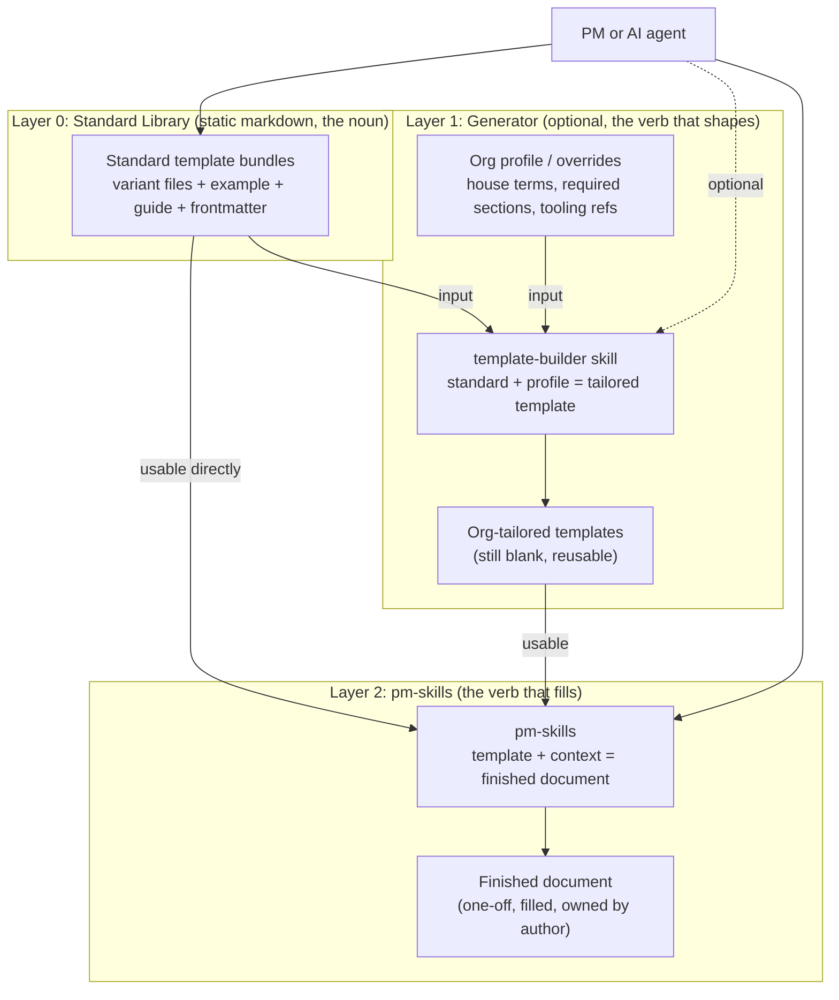

# PM/SDLC Template System: Layered Architecture Design

> **This is a new design, not a revision of `template-library-design-spec.md`.** That earlier spec describes the static library in isolation. This document zooms out and places that library inside a three-layer model so the "should it be an agent plug-in / generator" question has a clean answer.
>
> **One-line thesis:** the standard library, an optional generator, and `pm-skills` are three layers, not one product. Kept as layers they are complementary. Fused into one thing they conflict.

---

## 1. The Core Reframe

The confusion ("is this a folder of files, or an agent plug-in, or a generator?") dissolves once you see it is three different things, each a distinct part of speech:

| Layer | Part of speech | What it is | What it does |
|---|---|---|---|
| **Standard Library** | noun | Static markdown shapes | Exists to be copied and filled |
| **Generator** (optional) | verb (shapes) | A skill that customizes shapes for an org | `standard template + org profile = tailored template` |
| **pm-skills** | verb (fills) | The existing skill set | `template + context = finished document` |

Stacked, they read cleanly. The generator *produces* library artifacts. `pm-skills` *consumes* library artifacts. The library is the shared, static contract sitting between them. A generator does not compete with the library; it feeds it. It does not compete with `pm-skills`; it sits one level above it.

---

## 2. The Bright Line (the rule that prevents all conflict)

There is exactly one rule that keeps these three from collapsing into each other:

> **The generator outputs blank, reusable templates. `pm-skills` outputs filled, one-off documents.**

Hold that line and there is zero overlap. Blur it (let the generator start emitting finished PRDs with real content) and you have rebuilt `pm-skills`, badly. Every design decision below exists to protect this boundary.

---

## 3. Layer 0: The Standard Library (the substrate)

Unchanged from the earlier decision, and restated here only so the stack is complete:

- A repository of plain markdown document templates. No runtime, no engine, nothing reads them.
- One bundle per document type: variant file(s), a worked `example.md`, a `guide.md`, and per-file frontmatter.
- Variants are a hand-authoring choice about how many files to ship per type (default lean/full; S/M/L only where a type earns three weights; descriptive filenames preferred over abstract size letters).
- This layer is built first and is valuable on its own, with or without anything above it.

This layer is the foundation. Everything else is optional and attaches to it.

---

## 4. Layer 1: The Generator (optional, and only sometimes worth it)

The generator's real product is **not** "make me a template." Anyone can copy a file. Its real product is a **reusable org profile** plus the transform that applies it:

> `standard template + org profile = org-tailored template`

The **org profile** is the valuable, durable artifact: house terminology, required sections (for example a mandatory security-review gate), standard tooling and link references, tone, and which document types the org actually uses. The generator applies that profile across the standard library to emit an org's tailored set, and can **re-apply** it when the upstream standards improve.

This is the one thing plain fork-and-edit does badly: forks drift from upstream and lose improvements. A profile-plus-transform keeps an org's customization as a re-applyable layer rather than a frozen copy.

**This layer is pattern-consistent with `pm-skills`, not foreign to it.** `pm-skills` already ships a meta-tooling lifecycle (`pm-skill-builder`, `pm-skill-validate`, `pm-skill-iterate`) that creates, audits, and improves skills. A template generator is the exact analog one level over: create, validate, iterate templates. So this is the same shape `pm-skills` already uses, applied to a different object.

---

## 5. Layer 2: pm-skills (the filler, already built)

`pm-skills` is the consumption layer. It takes a template (standard or org-tailored) plus live context and produces a finished document. It already exists, already works, and needs no change for this system to function. The only optional, additive touch is a frontmatter cross-reference so a skill and a template can point at each other by ID.

---

## 6. Layered Architecture (diagram)

The same diagram is provided as a standalone file (`template-system-architecture.mermaid`) for easy reuse.



Read top to bottom: a static library at the base, an optional generator that reshapes it for an org, and `pm-skills` that fills whichever templates result. A user can enter at any layer.

---

## 7. Packaging: Three Shapes

| Shape | What it is | Best when |
|---|---|---|
| **A. Static library only** | A folder of standard MD files; orgs fork to customize | Customization is rare or one-time |
| **B. One plug-in: library + generator** | Standard files bundled as resources, plus a skill that emits org-tailored variants from profiles | You want a single installable product and org-tailoring is core |
| **C. Two repos** | `pm-templates` (static standards, the noun) plus a `template-builder` utility skill in or beside `pm-skills` (the verb) | You want each repo to stay exactly one kind of thing |

**Recommendation: C, reached by way of A.** Ship the static library first (Shape A is a complete, useful product). Design it from day one with a `profiles/` attach point so a generator *can* bolt on later. Add the generator as a separate sibling (Shape C) only after the decision gate below resolves in its favor. Do not build the generator speculatively.

C is the cleanest and most `pm-skills`-native: the library stays a pure folder of files, and the generator lives where `pm-skills` already keeps its builder lifecycle.

---

## 8. Compatibility with pm-skills (lean version)

With the agent/runtime machinery dropped, compatibility is now only static-file consistency:

1. **Shared hygiene:** same org conventions, Conventional Commits, SemVer, no-emdash sweep, `AGENTS.md`, Apache-2.0.
2. **Shared vocabulary:** a `phase` field in each template's frontmatter, on the Triple Diamond axis, so both repos speak one language.
3. **Cross-reference:** an optional `pairs_with` line so a reader can see which skill a template relates to. Human-facing, not load-bearing.
4. **Same habits:** an `example` and a `guide` per bundle, mirroring the `pm-skills` `references/` pattern.

None of this requires either repo to execute anything.

---

## 9. The Decision Gate

Whether to build Layer 1 at all hinges on a single question:

> **Is org template customization a one-time setup, or a living thing that must track an evolving standard set?**

- **One-time** (adapt once, never revisit): no generator needed. The org forks the library and edits. Git is the tool. A generator here is over-engineering.
- **Recurring** (the org wants its house standards applied across all templates and re-applied as the upstream library improves): the generator is not just complementary, it is the actual point.

Build nothing for Layer 1 until this is answered. Build Layer 0 regardless, because it is the substrate either way.

---

## 10. Designing Layer 0 So Layer 1 Can Attach Later

Cheap, non-committing things to do in the static library now so a generator is easy to add later without a rewrite:

- Reserve a top-level `profiles/` (or `overrides/`) path, even if empty, with a README describing intent.
- Keep template bodies cleanly separated from guidance (HTML comments) and metadata (frontmatter), so a transform has clean seams to operate on.
- Use a consistent placeholder convention so a generator can find and rewrite substitution points deterministically.
- Keep the `phase` and `doc_type` fields stable, so a profile can target document types by ID.

These cost nothing if the generator never ships, and save a refactor if it does.

---

## 11. Roadmap

- **Phase 1 (build now):** Layer 0 static library. One family fully worked. Reserve the `profiles/` attach point. This is a complete, shippable product.
- **Phase 2 (gate):** answer the Decision Gate question against real usage.
- **Phase 3 (conditional):** if recurring, build the generator as a sibling utility (Shape C): an org profile format plus the `standard + profile = tailored` transform, with validate/iterate analogs to `pm-skills`.
- **Phase 4 (optional):** wire `pairs_with` cross-references across library and skills.

---

## 12. Open Decisions

1. **One-time vs recurring customization** (the Decision Gate). Settles whether Layer 1 exists.
2. **Packaging B vs C** if the generator is built: one installable product, or two clean single-purpose repos.
3. **Profile format and scope:** what an org profile is allowed to change (terminology and sections, yes; full restructuring, probably not).
4. **Generator home:** in `pm-templates`, or as a foundation/utility skill inside `pm-skills`.
5. **Whether `pm-skills`' existing `overrides/` directory is meant for this** or is unrelated (not yet inspected).

---

## Appendix A: What an Org Profile Might Contain (conceptual)

Illustrative only. This belongs to Layer 1 and does not touch the static library.

```yaml
org: acme
house_terms:
  user: "member"
  experiment: "trial"
required_sections:
  prd: [security-review, accessibility]
  release-notes: [rollback-plan]
tooling_refs:
  tracker: "Acme Jira"
  design: "Acme Figma"
doc_types_in_use: [prd, user-stories, release-notes, adr]
tone: concise
```

Read as: take the standard library, apply these org-specific transforms, emit Acme's tailored (still blank) template set, re-applyable whenever the standard library improves.
