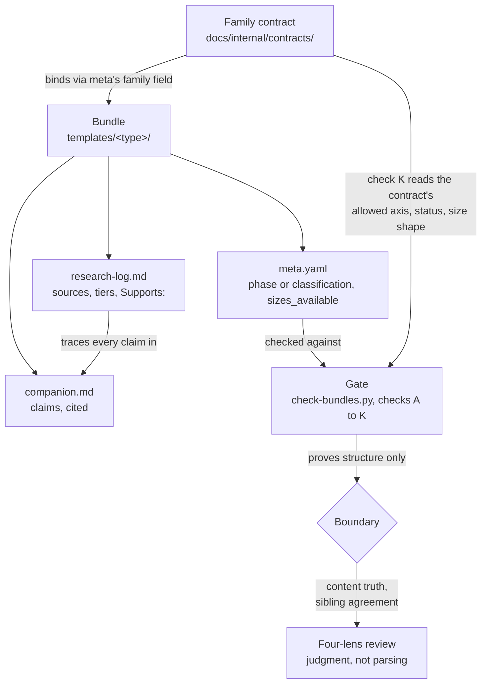

# Architecture overview

This library holds researched, machine-checked template bundles for product management and software
delivery documents. If you have just found the repository and want to understand how it is put together
in one sitting, start here. This page covers the shape of the thing, not the history of how it got here.

There are three layers, and they nest inside each other. A **bundle** is the unit of production: everything
about one document type lives in one folder. A **family** is a small set of bundles that share a contract,
so a reader of one delivery document can trust the others follow the same shape. A **gate** enforces both
layers mechanically, and stops exactly where mechanical checking stops.

## The bundle: one document type, one folder

A bundle is a folder named by its bare document-type handle, for example `templates/prd/`, and it holds
everything a reader or an author needs for that one document type. It is six core files, plus one blank
template file per size variant the type earns:

| File | Role |
|---|---|
| `<type>_template-lean.md` / `<type>_template-full.md` | The blank shape a document starts from |
| `<type>_companion.md` | The deep explainer: what the artifact is, its origins, and its cited references |
| `<type>_guide.md` | The operator card: when to use it, a quality rubric, named anti-patterns |
| `<type>_example.md` | A single, fully worked instance, with no placeholders and no fabricated numbers |
| `<type>_meta.yaml` | The machine manifest: identity, size contract, family membership |
| `<type>_history.md` | The changelog, keyed to the version the meta declares |
| `<type>_research-log.md` | The evidence trail behind every claim the companion makes |

The `prd` bundle ([`templates/prd/`](../../templates/prd/)) is the concrete worked example: it carries all
eight files the lean-plus-full common case predicts. The doc-type handle prefixes every filename, so a
file is self-identifying if someone moves it or pastes it somewhere out of context. Phase (when in a
project a document gets written) lives only in the meta, never in the folder path, so the directory layout
never has to change when a document's place in the lifecycle is reconsidered
([ADR 0005, bundle IDs are bare doc-type handles](../internal/decisions/0005-bundle-ids-doctype-spine.md)).

Bundling by document type rather than shipping loose files buys one thing: everything that has to stay
consistent about a document type (its blank shape, its explanation, its worked instance, its evidence)
lives together and gets reviewed together. A change to the full template that the lean template's nesting
rule requires, or a claim in the companion that the research log has to support, is a same-folder problem,
not a cross-repository search.

Two rules keep a bundle internally honest. First, **nesting**: a smaller size variant's sections are an
ordered subset of the larger variant's, unchanged in name and order, so a document can grow from lean to
full in place without being re-authored
([ADR 0002, the variant model](../internal/decisions/0002-variant-model.md)). Second, **the meta declares
the contract, and the files on disk have to match it in both direction**s: `sizes_available` in
`<type>_meta.yaml` is not a description of whichever files happen to exist, it is the declaration of what
the bundle is, and a declared-but-missing variant fails the same way an undeclared stray file does
([ADR 0010, meta declares the size contract](../internal/decisions/0010-meta-declares-size-contract.md)).

## The family layer: bundles that share a contract

A bundle's meta carries a `family` field, and that field binds it to a family contract in
[`docs/internal/contracts/`](../internal/contracts/). A family contract narrows the general metadata
schema to a specific set of values a member of that family must declare: the correct taxonomy axis (every
bundle declares exactly one of `phase` or `classification`, never both), the family's allowed value on
that axis, an allowed publication status, and an allowed size shape. The `delivery-docs` family, for
example, requires `phase: deliver`, a `beta` or `stable` status, and a size shape of `[lean, full]` or
`[lean]` ([ADR 0020, adopt the delivery-docs family contract](../internal/decisions/0020-adopt-delivery-docs-family-contract.md)).

Nine family contracts exist today, each its own file: `delivery-docs`, `decision-docs`, `governance-docs`,
`qa-docs`, `strategy-docs`, `discovery-docs`, `standing-standards`, `process-docs`, and `communication-docs`
(all in [`docs/internal/contracts/`](../internal/contracts/)). A family can be adopted before any bundle
of that family is built; the contract is latent until a member lands, and the gate is indifferent to how
many members a family eventually has.

A family contract asks for more than the gate can check. Each contract's own enforcement section states
plainly which of its obligations are machine-checked (the metadata values above) and which remain a
review-time judgment: guidance-comment grammar, the companion's skeleton, the guide's shape, and whether
a worked example genuinely stands on its own. The contract is the fuller promise; the gate is the part of
that promise a script can verify.

## The gate, and the honest boundary around it

[`tools/check-bundles.py`](../../tools/check-bundles.py) runs eleven lettered checks, A through K, against
every bundle in the library. Each one is answerable by parsing text, never by judging whether the text is
right: files present and no strays, no em-dash or en-dash character, lean nested inside full, no leftover
placeholder in the worked example, citations resolving in both directions, the meta's size vocabulary
internally consistent, every YAML block parsing, a history entry for the declared version, `pairs_with`
and `related_templates` resolving, the meta validating against
[`tools/meta.schema.json`](../../tools/meta.schema.json), and family conformance (check K, the layer above).
GitHub Actions runs this gate on every push and every pull request, and `main` is branch-protected on it,
so a bundle that fails a check cannot merge. Beyond the gate itself, further CI steps close specific gaps
the per-bundle gate cannot see on its own, among them a repository-wide link check, generated-artifact
freshness checks for the manifest and the atlas, and a repository-wide dash sweep.

The boundary this gate draws is the most important thing to understand about the library, and it is stated
as directly as the tree allows in [`docs/explanation/what-the-gate-proves.md`](what-the-gate-proves.md): a
machine proves structure, never content. The gate can confirm a citation resolves to an anchor; it cannot
confirm the quoted words actually appear at that source, because it never reads the source. It can confirm
a companion, a guide, and an example each parse; it cannot confirm they agree with each other about when
the document type applies. Closing that gap is the job of a four-lens review that reads a bundle before it
ships, and [`docs/internal/review-standards.md`](../internal/review-standards.md) names, item by item, the
kinds of defect that have shipped past a green gate before. Coverage is not validation, and the library
says so about itself.

## Where the evidence lives

Every bundle's `<type>_research-log.md` is a committed file, not disposable scaffolding, because it is
what makes "researched, not remembered" auditable rather than merely asserted
([ADR 0007, the research log as a bundle artifact](../internal/decisions/0007-research-log-as-bundle-artifact.md)).
Each source entry carries a number, a title, an author or organization, a URL (or a stated reason there is
none), a tier drawn from a fixed vocabulary, and a `Supports:` clause naming what the source backs, even
when the honest answer is nothing. Every source also carries a retrieval-status token: `fetched-and-verified`
(the body was actually read, and only these may be quoted), `url-confirmed-not-read`, or `not-retrieved`.
A companion's claim that cannot be traced to a logged entry is exactly the defect class the four-lens
review exists to catch.

A second kind of evidence sits above the bundle layer: artifacts the tooling generates from the bundles
themselves rather than an author retyping by hand, among them [`manifest.json`](../../manifest.json) (the
machine catalog, from `tools/gen-manifest.py`), [`sections.json`](../../sections.json) (the AG-1 section
schema: every section of every template variant, its guidance fields and its fill sites, from
`tools/gen-sections.py`), and the atlas dataset (from `tools/gen-atlas.py`). All three
generators run in a `--check` mode in CI that regenerates the artifact in memory and fails on any drift
from the committed copy, on the same reasoning stated throughout the tooling: a generated fact stays
fresh, a retyped one drifts.

## A map of the repository

- [`templates/`](../../templates/) holds every bundle, one folder per document type, plus
  [`templates/methodology.md`](../../templates/methodology.md), the authoring process and Definition of
  Done every bundle is built against.
- [`docs/internal/decisions/`](../internal/decisions/) holds the decision records, in MADR v4, that this
  page cites throughout; [`docs/internal/contracts/`](../internal/contracts/) holds the family contracts.
- [`docs/internal/bundle-pipeline.md`](../internal/bundle-pipeline.md) and
  [`docs/internal/review-standards.md`](../internal/review-standards.md) describe how a bundle gets built
  and reviewed before it lands.
- [`docs/`](../) itself is organized in the four [Diataxis](https://diataxis.fr/) quadrants: `tutorials/`,
  `how-to/`, `reference/`, and this `explanation/` folder.
- [`tools/`](../../tools/) holds the gate, the family and metadata checks, the generators, and the lint
  scripts that feed the four-lens review candidate phrases to judge.
- [`atlas/`](../../atlas/) holds the generated browsing view of the catalog;
  [`manifest.json`](../../manifest.json), [`STATE.md`](../../STATE.md), and
  [`CHANGELOG.md`](../../CHANGELOG.md) sit at the repository root as the single sources of truth for the
  machine catalog, current build state, and release history respectively.

## How the layers constrain each other

## Where to go for the mechanics

This page is the shape of the thing. For the mechanics, section by section, including exactly which script
enforces which rule and how the pieces fit together for someone extending the library, see
[`architecture-detailed.md`](./architecture-detailed.md).
