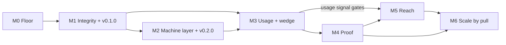

# Delivery Roadmap (Expanded): From Audited Prototype to Reference Implementation

> **Currency note, added 2026-07-26, refreshed 2026-08-14. This file is a dated projection;
> [`STATE.md`](../../STATE.md) outranks it wherever they disagree.** That is not a criticism of the
> roadmap, it is the rule STATE.md was created to enforce. Read this banner before trusting any
> sequencing below.
>
> **Still live:** the milestone and work-package numbering, the sequencing thesis in section 1 (floor,
> then wedge, then proof, then reach), the M3 through M6 work packages and their acceptance criteria, and
> sections 5 (non-goals), 6 (risks) and 7 (traceability).
>
> **Overtaken, and by what:**
>
> - **Everything about bundle sequencing, family composition, and what gets built next**, now governed by
>   [`buildout-specs.md`](buildout-specs.md) and executed per [`bundle-pipeline.md`](bundle-pipeline.md).
>   Do not read section 3's M0 through M2 work packages as the current build order.
> - **Section 4's week-by-week timeline**, which is a historical calendar. It is marked as such in place.
> - **M2 is complete**, and its exit act was not the `v0.2.0` this file names. See the milestone table.
>
> This file was written 2026-07-10 and last cites **ADR 0020**; there are now **40** decision records, and
> twenty of them (0021 through 0040) postdate it and change the plan it describes.
>
> Recorded as finding **DF-3 (gated documents stay fresh, ungated ones drift)** in STATE.md. This file is
> one of the ungated. **The banner you are reading drifted too**, which is finding **DF-5 (prose counts
> drift)**: it was added on 2026-07-26 to manage staleness and its own decision-record count was wrong
> within two days. Since 2026-07-28 the counts marker below is compared against the tree by
> [`tools/check-counts.py`](../../tools/check-counts.py), so a changed number now fails CI instead of
> ageing quietly here. **The counts marker did its job and the prose around it still went stale**: between
> 2026-07-28 and 2026-08-14 this file's status column claimed 18 of 27 types were built and that `v0.2.0`
> was the next release, through three tagged releases, while every marker in it matched the tree. That is
> the limitation `check-counts.py` prints on every run, costing something for the second time.

<!-- counts: adrs=40, bundles=26 -->

- **Date:** 2026-07-10
- **Basis:** `AUDIT_REPORT.md` (49 findings, 19 adversarially verified) and its section 5 roadmap, expanded here into milestones, work packages, acceptance criteria, and dependencies
- **Status:** proposal for maintainer ratification (recommend recording the adopted version as an ADR)
- **Companions:** `11_resources-and-sustainability.md` (who/what/how much), `12_catalog-recommendations.md` (what to build next), `13_excellence-and-innovation.md` (differentiation plays), `specs/` (build specs referenced by work packages)

> **A note on the references in this file.** This roadmap was written inside the 2026-07-10 audit
> package and was promoted into `docs/internal/` on 2026-07-14, because `STATE.md` depends on it and
> a living roadmap should not stay frozen inside a dated audit ([decision 0013](decisions/0013-local-split-and-going-public.md)).
> The rest of that audit package stayed **private and untracked**, so the companion documents named
> above (`AUDIT_REPORT.md`, the numbered sections, and `specs/`) are **not in this repository**. They
> live at `_local/audit/2026-07-10_fable-audit/` on the maintainer's machine.
>
> They appear here as plain text rather than links, deliberately. A tracked file linking into
> `_local/` resolves for exactly one person and 404s for everyone else, which is why
> `tools/check-links.py` now fails the build on it. The honest cost, recorded in decision 0013's
> consequences: several claims in this repo cite findings that an outside reader cannot follow to
> their source.
>
> **`STATE.md` outranks this file.** This is a dated projection; that is the current truth.

---

## 1. Sequencing thesis

**Floor, then wedge, then proof, then reach.** Every deep investment (evals, MCP, more bundles) is discounted while a fresh clone disproves the front-door claims in five minutes. The floor (license, CI, tag, truthful plan) costs about one day and makes the claims true. The wedge (LP-2 grade-my-doc) needs only the four existing bundles and produces the first real usage signal. Proof (EV-1 efficacy evals) then measures something real instead of authored examples. Reach (LP-1 fill flow, AG-2 MCP, marketplace) amplifies whatever exists, so it goes last, where it multiplies a proven thing instead of zero.

This ordering was adversarially stress-tested during the audit (finding G-03, roadmap sequencing, CONFIRMED): the repo's published 80/20 (evals, usage loop, MCP first) is internally contradicted by its own YAGNI risk section, and both are pre-empted by the credibility floor. Three rules keep this roadmap honest where the old plan went stale:

1. **The plan is subordinate to reality.** A STATE block (see WP-04) is updated in the same commit as any milestone exit. A roadmap that says "Not started" while the tree says otherwise is a defect (this is what audit finding G-01, stale plan, was).
2. **Decision SLA.** Any open decision with a stated resolution cost under 2 hours is resolved within 3 working days or explicitly re-dated with a reason (audit finding E-05, decision triage).
3. **Marketing tense discipline.** Present tense only for what exists; roadmap tense for the rest (the root cause behind audit findings G-02, F-05, and C-01's marketing gap).

**Baseline assumption:** solo maintainer at roughly 10 to 15 focused hours per week, heavily agent-leveraged (see the resources doc). Calendar durations below assume that; compress or stretch proportionally.

---

## 2. Milestone overview

**Status column added 2026-07-28, refreshed 2026-08-14.** The milestone names below are still the live
vocabulary, but several of them no longer describe what actually happened, so the real state is recorded
here rather than inferred. [`STATE.md`](../../STATE.md) remains authoritative wherever this disagrees.

| Milestone | Goal | Duration (est.) | Exit act | **Status (2026-08-14)** | Closes (primary) |
|---|---|---|---|---|---|
| M0 Credibility floor | A fresh clone survives the five-minute sniff test | 1 day | CI green on main | **Done** | E-01, D-03, G-01, F-03, B-04, C-05, B-08, F-07 |
| M1 Integrity and truth | Content claims verifiable; decisions closed; first release | 1 week | Tag v0.1.0 with a dogfooded release note | **Done 2026-07-17** | A-01..A-06, D-02, E-03 (D2), D3, F-01, F-05, G-02 |
| **M2 Machine layer, contract, and the Tier-1 floor** | The library is machine-consumable, lives at its final path, and covers the catalog's must-have set | 2 weeks as estimated; **roughly four in practice** (2026-07-12 to 2026-08-07) | Tag v0.2.0 | **Done 2026-08-07.** The machine layer shipped (schema, manifest, atlas, freshness gates). The Tier-1 floor build-out ([ADR 0021](decisions/0021-complete-the-tier-1-floor.md)) was adopted **after** this roadmap was written and folded into this milestone rather than given its own. **26 bundles cover all 25 templatable Tier-1 types across nine complete families, every family contract is adopted, and the build backlog is empty.** The 27-to-25 reconciliation is [ADR 0030](decisions/0030-templating-scope-markdown-documents.md) (`wireframe` and `interactive-prototype` are not documents) and [ADR 0035](decisions/0035-prototype-brief-fails-the-admission-test.md). **The exit act was not `v0.2.0` alone**: the milestone spanned `v0.2.0`, `v0.2.1`, `v0.3.0` and `v0.3.1`, and the library reached **Gold (advanced)** on the Advanced Skill Library Standard, measured in CI rather than declared | B-01, B-02, C-03, C-04, C-06, C-08, C-09, E-06, E-07 done at M1, F-02, F-06, G-04 |
| M3 First usage and wedge | One real usage cycle; LP-2 shipped; demand capture live | 1-2 weeks (overlaps M2 tail) | First external doc graded + EV-3 form banked | **Next, and now the binding constraint.** Still **zero real fills**. Two parts moved without the milestone starting: the D2 install retest was run 2026-08-08 (recorded in full under M3 below), and **the intake half of WP-32 is built** (three issue templates shipped 2026-08-07). WP-30 (LP-2, the wedge itself) is not started. **ADR 0021's floor override has expired on its own terms**, since its stated scope was the Tier-1 floor and that floor is complete, so section 1's original ordering resumes here | D-05, E-04 partial, E-02 partial |
| M4 Proof | Quality measured, not asserted; regression-protected | 2 weeks | Per-bundle eval scorecards published | **Partly started, and the first numbers came back VOID.** [`eval-protocol.md`](eval-protocol.md) is written, the harness runs, and two independent 114-agent runs completed 2026-08-08 agreeing within 0.13 on every quantity. **Both are VOID on discrimination**, and **three bundles of 26** are measured. What survives is the circularity signature: **+0.85** on criteria drawn from the templates' own guide beside **-0.03** on criteria drawn from neither. Four blockers remain, listed under WP-40 | D-04, EV-2, CT-1 (conditional) |
| M5 Reach | Agents can discover, select, fetch, fill, validate | 4-6 weeks, gated on M3 signal | MCP + fill flow live; distribution per D2/D3 outcomes | **Not started**, correctly gated on M3 | C-01, E-02 remainder, AG-1, AG-2 |
| M6 Scale by pull | Next family by demand; sustainable cadence | ongoing | Quarterly freshness pass #1 completed | **Not started** | E-04, G-05, VL-1/VL-3 |

Dependency spine:



---

## 3. Work packages

Effort: S = under 1 hour, M = roughly half a day, L = one or more days. Traces: audit finding IDs and specs.

### M0: Credibility floor (1 day total)

| WP | Work package | Deliverables | Effort | Traces |
|---|---|---|---|---|
| WP-01 | License grant | `LICENSE` (Apache-2.0, copied from `pm-skills/LICENSE`) at repo root | S | E-01 |
| WP-02 | CI bridge | `.github/workflows/ci.yml` running `python tools/check-bundles.py` on push and PR (snippet in AUDIT_REPORT.md finding D-03) | S | D-03, G-02 |
| WP-03 | Hygiene sweep | Delete `templates/_working/`; fill `maintainer`/`owner` placeholders in 4 metas + methodology; relabel dangling `related_templates` entries with `future:` prefix; sweep bare P1/P3 IDs in plan and gate docstring | S | B-08, C-05, B-05, F-07 |
| WP-04 | Truth infrastructure | Plan progress table updated to actual; dated Revisions row recording the content-first re-sequencing; `STATE.md` at root (10 lines: built vs planned, counts, gate status, last-updated); superseded banner atop the design spec | S/M | G-01, G-04 |
| WP-05 | Decision records | `docs/internal/decisions/` with MADR TEMPLATE.md plus 7 transcribed ADRs (4 foundational from 2026-06-29; guidance style; research log as 8th file; Python/local gate as interim) | M | F-03, G-06 |
| WP-06 | Rulebook consistency | methodology.md "seven files" corrected to eight in both places + research-log row added to the section 2 table + drafting step added | S | B-04, C-07, F-04 |

**M0 acceptance criteria**
- [ ] `git ls-files` shows LICENSE, STATE.md, `.github/workflows/ci.yml`, `docs/internal/decisions/` with 8 files.
- [ ] CI run visible and green on GitHub for the merge commit.
- [ ] `python tools/check-bundles.py` still exits 0.
- [ ] Grep for `{{maintainer}}` and `{{owner}}` returns only template-variant placeholder lines (none in metas or governance frontmatter).
- [ ] The plan's Completion Status table matches the tree (spot-check P4 marked done with commit evidence).

### M1: Integrity and truth (week 1)

| WP | Work package | Deliverables | Effort | Traces |
|---|---|---|---|---|
| WP-10 | Citation integrity pass | SVPG entries gain retrieval qualifiers; Ranorex claim re-sourced or labeled author judgment; ~~Keep a Changelog corrected to 1.1.2 with root URL~~ **(withdrawn 2026-07-16: this instruction was wrong, see note below)**; PRD refs 8 and 12 cited or removed, ref 12 retagged; Lenny quote de-quoted to paraphrase or verified via subscription; combined entries split; methodology section 6 gains the blocked/paywalled-source convention and the book/pre-web format rule | M | A-01..A-06, B-03 |
| WP-11 | Gate hardening v1 | check-bundles.py adds: reverse citation direction (padded entries fail); meta placeholder scan; history entry for current template_version; `pairs_with` resolution against a pinned skill-ID list; `related_templates` resolution against local bundles + `future:` convention; heading check extended to (level, text) tuples | M | D-02, D-01 partial, D-06, B-05 |
| WP-12 | Decision closure | D2 skills-CLI install test run and recorded (30 min); D3 agentskills.io spec read and recorded (1 h); both closed in the plan with dated outcomes; decision SLA rule written into CONTRIBUTING (or STATE.md until it exists) | M | E-03, E-05 |

> **WP-10 correction, 2026-07-16: the "Keep a Changelog corrected to 1.1.2" instruction was itself
> wrong and is withdrawn.** Verified at the source: `keepachangelog.com/en/` serves **1.1.0** and
> advertises no other version; `/en/1.1.1/` and `/en/1.1.2/` return HTTP 200 but are 242-byte redirect
> stubs whose entire body is a canonical link and meta-refresh pointing **back to 1.1.0** (nonsense
> versions like `/en/9.9.9/` 404 properly, so those 200s are real routes, not a catch-all). The repo
> does carry `v1.1.1` and `v1.1.2` tags, and its latest *release* is v1.1.1, but those are site/repo
> releases, not published spec versions; the audit most likely read a tag and mistook it for the spec.
> The `release-notes` companion's existing citation (version 1.1.0 at `/en/1.1.0/`) is correct and is
> the site's own declared canonical URL, so it was left unchanged. Recorded here because an audit
> finding that is wrong will otherwise be executed on faith: following this row would have *introduced*
> the defect class WP-10 exists to remove. See `templates/release-notes/release-notes_research-log.md`.
| WP-13 | Consumer quickstart | README gains "Quick start: use a template" (6 literal steps); README claim reconciliation ("enforceable" scoped to what CI now actually runs; "complete/verified" aligned with beta status) | M | F-01, F-05, G-02 |
| WP-14 | Release v0.1.0 | CHANGELOG.md with [0.1.0] section; git tag v0.1.0; release notes written **using the library's own release-notes lean template** (first dogfood artifact) | S | E-07, dogfood play (13_excellence section 3) |

**M1 acceptance criteria**
- [ ] Extended gate exits 0 on all four bundles and would fail a synthetic padded-entry fixture (keep the fixture test in the tools folder).
- [ ] No companion asserts an unqualified access date for a source the research log marks as blocked or excerpt-only.
- [ ] D2 and D3 rows in the plan read Resolved with date and one-paragraph outcome.
- [ ] A newcomer following only the README quickstart can produce a filled lean PRD (test this literally with one person or one agent run).
- [ ] `git tag` lists v0.1.0; the GitHub release body is the filled release-notes template with provenance frontmatter.

### M2: Machine layer, contract, and the Tier-1 floor (weeks 2-3)

Ordering note: graduation (WP-20) runs FIRST so every machine surface (schema, manifest, MCP later) is built against final paths, not `_local/` paths that would need re-stamping.

| WP | Work package | Deliverables | Effort | Traces / spec |
|---|---|---|---|---|
| WP-20 | HY-2 decision + graduation | ADR deciding the final scaffold (recommended: flat `templates/<type>/`); migration checklist executed as one atomic commit (README links, methodology applies_to, gate TEMPLATES_DIR, session/audit docs get a pointer note); redirect note left in `_local/`. **Done 2026-07-12 ([ADR 0009](decisions/0009-scaffold-graduation-flat-templates.md)): the scaffold graduated to flat `templates/`, closing HY-2, well before M2. The one deliverable not literally present is the `_local/` redirect note, which is gitignored and so not a tracked artifact.** | M | E-06, HY-2 |
| WP-21 | Metadata schema | `tools/meta.schema.json`; gate check **J** validates every meta against it. **Done 2026-07-17 (#20): [ADR 0016](decisions/0016-adopt-machine-checkable-metadata-schema.md) adopts the schema (from the accepted RFC-0001), [ADR 0017](decisions/0017-gate-may-use-jsonschema-for-meta-validation.md) grants the jsonschema dependency.** | M | B-02; `specs/spec_machine-metadata.md` |
| WP-22 | Machine catalog | `manifest.json` generated at root (script `tools/gen-manifest.py`); count-consistency check (README count == manifest count == bundle dirs). **Done 2026-07-17 (#22): [ADR 0018](decisions/0018-machine-catalog-generated-manifest.md); `gen-manifest.py --check` runs in CI, fails on drift or a stale README `<!-- bundle-count -->` marker.** | M | C-03; machine-metadata spec |
| WP-23 | Selection metadata | `sizing_guidance`, `default_size`, generated `approx_tokens` map per meta; regenerate manifest. **Done 2026-07-18 (#23): [ADR 0019](decisions/0019-selection-metadata-and-approx-tokens.md); `default_size` checked against `sizes_available` by gate check F, `approx_tokens` is a stdlib chars/4 heuristic (no tokenizer dependency), kept fresh by `gen-manifest.py --check`.** | S/M | C-04, C-06; machine-metadata spec |
| WP-24 | Family contract | `_families/delivery-docs.contract.md` (modeled on the pm-skills meeting-skills contract); gate family check. **Done 2026-07-20 (#24): the contract lives at [docs/internal/contracts/delivery-docs.md](contracts/delivery-docs.md) (not `_families/`, avoiding churn for no gain), adopted and enforced by gate check K. On first enforcement, methodology was made descriptive rather than gated ([ADR 0020](decisions/0020-adopt-delivery-docs-family-contract.md)); methodology-specific packs reserved as a Tier-2 future.** | M | B-01 |
| WP-25 | Fill tooling | `tools/strip-template.py` (strip comments, stamp fill_date); `filled_by`/`fill_method` placeholder fields added to all variants | S/M | C-09, C-08; LP-1 spec section 4 |
| WP-26 | Freshness automation v1 | lychee (or equivalent) link-check over all tracked markdown in the same CI workflow; research logs gain `fetch_status` column; failure policy: dead link fails CI, paywall/403 requires qualifier | M | A-03 systemic, G-05, FR-1 |
| WP-27 | Docs tree | CONTRIBUTING.md; `docs/contributing/authoring-contract.md` (composed reference index); `docs/reference/gate-checks.md` and `metadata-schema.md`; README split so consumer content leads and contributor content moves out (target under 120 lines) | L | F-02, F-06; AUDIT_REPORT section 7 tree |
| WP-28 | Release v0.2.0 | CHANGELOG [0.2.0]; tag; release note dogfooded again. v0.2.0 semantics: the delivery-docs family complete WITH its rails (contract + validator), matching the original plan's AC-14 intent | S | E-07 lineage, plan AC-12/AC-14 |

**M2 acceptance criteria**
- [ ] `templates/` is the canonical path; zero content references to `templates/` remain outside historical docs (grep-verified); gate runs from the new path.
- [ ] `python tools/check-bundles.py` now reports checks A through J (or however lettered) including schema, family, pairs_with, related_templates, link-status summary.
- [ ] `manifest.json` validates against its own schema, lists 4 bundles, and regeneration is idempotent.
- [ ] An agent given only manifest.json can answer: which bundle for each of the 3 audit test intents, which size by default, and what each fetch costs in approx tokens (re-run the Dimension C simulation; all 6 of 6 decisions should now be deterministic).
- [ ] CI fails on a deliberately broken fixture for: schema violation, padded citation, dead link (test once, then remove fixtures).

> **M2 exit, recorded 2026-08-14.** The milestone is complete, and the boxes above are deliberately left
> unchecked because two of them were never verified as written and one has been superseded.
>
> **Met, and verifiable by running something:** `templates/` is the canonical path and the gate runs from
> it; `check-bundles.py` reports checks A through **K**, one further than this list anticipated; the
> broken-fixture requirement is met and then some, by five mutation-checked self-tests rather than by
> throwaway fixtures.
>
> **Superseded:** `manifest.json` lists **26** bundles, not the 4 this criterion was written against, and
> `gen-manifest.py --check` holds it fresh in CI.
>
> **Never done:** the Dimension C selection simulation was not re-run. Nobody has tested whether an agent
> given only `manifest.json` makes the six selection decisions deterministically, so the "agent-native"
> claim rests on the surface existing rather than on the surface working. **This is the same shape as the
> install that sat unrun for three weeks**: a claim about what a stranger receives, checked by nobody.
> It is cheap, and it is carried forward to WP-53.

### M3: First usage and wedge (weeks 3-4, overlapping M2 tail)

| WP | Work package | Deliverables | Effort | Traces / spec |
|---|---|---|---|---|
| WP-30 | LP-2 grade-my-doc | `skills/grade-doc/SKILL.md` + rubric extraction per spec; report-card output format; works on all 4 bundles | L | D-05 path, E-04; `specs/spec_lp2-grade-my-doc.md` |
| WP-31 | First real usage cycle | One real internal document filled from the lean PRD (or user-stories) template; EV-3 five-question feedback form designed and completed; outcome recorded in the bundle history | M | D-05, EV-3 |
| WP-32 | Demand capture | GitHub issue form as the pull queue (structured fields: requested type, requester context, methodology, urgency); atlas `catalog-data.json` gains a per-type `state` field (built / queued / pull-gated / out-of-scope) with an atlas legend. **Half built as of 2026-08-14; the remainder is specified in [`pull-queue-spec.md`](pull-queue-spec.md)** | M | E-04, P7, VS-3; `12_catalog-recommendations.md` section 5 |
| WP-33 | Wedge outreach | LP-2 run against 3 to 5 real documents from real PMs (network, community); each produces a report card and an EV-3 form | M | D-05, E-04 |

> **M3 status, 2026-08-14. This is the next milestone, and two of its four work packages have moved
> without it being started.**
>
> | WP | State |
> |---|---|
> | **WP-30 LP-2 grade-my-doc** | **Not started.** `skills/` holds only `plt-fill-template`. Its build spec is complete and has been ready since 2026-07-10. **This is the wedge**, and it is the only item in this entire roadmap that delivers something to a person who has not adopted the library |
> | **WP-31 First real usage cycle** | **Not started. Zero fills by anyone but the author**, which is the library's binding constraint and has been since it existed |
> | **WP-32 Demand capture** | **Half built.** `.github/ISSUE_TEMPLATE/` holds `new-type.md`, `usage-report.md` and `correction.md`, shipped 2026-08-07. **Zero issues have been filed**, the three labels those templates declare do not exist in the repository, `docs/reference/pull-queue.md` does not exist, and `catalog-data.json` still carries `built` with no `state`. The remainder is specified in [`pull-queue-spec.md`](pull-queue-spec.md) |
> | **WP-33 Wedge outreach** | **Not started**, and it is the only work package here that creates demand rather than capturing it. Shipping WP-32 and reading an empty queue as evidence that nobody wants the library would be the wrong reading |
>
> **Why this milestone matters more than it did in July.** When this file was written, deferring M3 was
> defensible: the library was too thin to pull. [ADR 0021](decisions/0021-complete-the-tier-1-floor.md)
> made that argument explicitly and bought the time to fix it. The floor is now complete, so the argument
> has been spent. There is no remaining Tier-1 work to prefer over the wedge, and Tier-2 and Tier-3 are
> demand-gated by that same ADR, so **there is no template backlog at all** until WP-32 produces one.

**M3 acceptance criteria**
- [ ] At least one filled document exists whose author is not the library author, or whose content is a real work artifact (not an authored example); its provenance frontmatter is stamped and its EV-3 form is stored.
- [ ] LP-2 grades a never-seen PRD in under 3 minutes of wall-clock agent time and its report card cites specific rubric line items.
- [ ] The pull queue has at least one genuine external entry OR a documented outreach log showing five attempts. **Partly addressed 2026-08-07: the intake exists. Zero entries received, and no outreach log exists.**
- [x] Because LP-2 ships as a SKILL.md in this repo, the D2 question is retested with the skill present: record whether `npx skills add product-on-purpose/product-lifecycle-templates` now installs (this is the distribution unlock the audit predicted). **Run 2026-08-08 against `skills@1.5.22`. It installs. It is not yet the unlock the audit predicted, and the reasons are below.**

**D2 retest, 2026-08-08, recorded in full because it has been open since 2026-07-17 and because two of its three findings are unwelcome.**

| Probe | Command | Result |
|---|---|---|
| Discovery | `skills add <repo> --list` | **Found 2 skills**, not 1 |
| Install | `skills add <repo>` | **Succeeds**, exit 0, project scope |
| Payload | inspect the install | **12 KB**, two files, no library |
| Old layout | same CLI against a `v0.2.1` worktree | **Found 1 skill** |
| Ref pinning | `skills add <repo>@v0.1.0 --list` | returns skills that exist only on `main` **(true, but the inference drawn from it was wrong: see the withdrawal below)** |

**1. It installs, and that closes the question as asked.** The layout adopted in ADR 0036 is discoverable
and installable. Nothing about the file's location is wrong.

**2. It installs two skills, and the second one should not ship.** `.claude/skills/build-bundle` is
maintainer-internal and says so in its own description. The CLI's search path includes `.claude/skills`
deliberately (`AGENT_PROJECT_SKILL_DIRS`), its `SKIP_DIRS` is
`["node_modules", ".git", "dist", "build", "__pycache__"]`, and it reads no ignore file. **There is no
supported way to exclude it**, so this is recorded as open rather than fixed.

**3. The installed skill is inert, and this is the finding that matters.** What lands is `SKILL.md` and
`README.md`. `manifest.json` is absent, all 26 bundles are absent, and every `../../` link in the skill
is dangling. The skill's own step 1 is "Read `manifest.json` at the repository root", and after an
install there is no repository. **The Claude Code plugin channel clones the whole repository and does
not have this problem**, so the library has two distribution channels and only one of them delivers a
working artifact.

**What this refutes.** The 2026-08-08 session log's finding #8 concluded the old root `SKILL.md` "was
probably never installable". For this consumer that is **wrong**: the CLI found it, and found exactly one
skill, because a root `SKILL.md` short-circuits the subdirectory search. The relocation was still correct
(the plugin loader and the Standard both require `skills/<name>/`), but it **regressed** this channel by
removing the thing that was suppressing the `build-bundle` leak. The finding's other half, about the
Claude Code plugin loader, was not tested here and may still hold.

**An upstream defect worth knowing about. WITHDRAWN 2026-08-08 on a controlled retest, and the error was
ours.** This paragraph claimed that `skills add <repo>@<ref>` "prints the ref and clones the default
branch anyway", and that "anyone pinning a version through this CLI is not getting one". **That is
false.**

**`@` is not the ref separator. `#` is, and it works.** Re-probed against `skills@1.5.22`, the latest
published version, each run in a fresh directory:

| Command | Skills returned | Tree actually used |
|---|---|---|
| `add <repo> --list` | `plt-fill-template` | default branch |
| `add '<repo>#v0.2.1' --list` | `product-lifecycle-templates` | **`v0.2.1`, correctly** |
| `add '<repo>#v0.1.0' --list` | none, exit 1 | **`v0.1.0`, correctly** |
| `add <repo>@v0.2.1 --list` | `plt-fill-template` | default branch |
| `add <repo>@v9.9.9 --list` | `plt-fill-template` | default branch, no error |

The two middle rows carry the proof. `#v0.2.1` returns a skill that exists **only** at that tag and
nowhere on `main`, and `#v0.1.0` correctly finds nothing in a tree that contains no `SKILL.md` at all.
Ref pinning works, and a version pinned through this CLI is honoured.

**What survives is a UX wrinkle rather than a defect, and it is not worth a third party's triage time.**
`@<anything>` is accepted silently, including a ref that does not exist, and echoed into the Source line
as `.git @v9.9.9`, which is one space away from the working syntax's `.git @ v9.9.9`. Someone who typed
`@` where they meant `#` gets no error and a confirmation line that reads like success. Deliberately not
filed upstream.

**This is written out at length because of the methodological point, not the CLI.** The original claim
rested on one command with no comparison run beside it. It is the **third** finding withdrawn in two days
for that same reason, after the efficacy pilot's -0.81 and finding #8's "probably never installable". A
single observation with no control cannot distinguish *the tool ignored my input* from *I used the wrong
input*, and all three times the second was true.

### M4: Proof (weeks 5-6)

| WP | Work package | Deliverables | Effort | Traces / spec |
|---|---|---|---|---|
| WP-40 | EV-1 efficacy evals | `evals/` with 12 scenarios (3 per bundle); with-template vs freehand arms; 3-judge blind rubric panel; baseline discrimination gap recorded per bundle | L | D-04; `specs/spec_ev1-efficacy-evals.md` |
| WP-41 | Quality scorecard | EV-2 scorecard fields in meta (research depth, citation mix, freshness, eval gap); badge line in each bundle landing and README table | M | EV-2, 13_excellence play 1 |
| WP-42 | Conformance levels | Gate reports L1 (structure) / L2 (research integrity) / L3 (eval-proven) per bundle; levels shown in manifest and atlas | M | 13_excellence play 4 |
| WP-43 | Second-domain example (conditional on usage signal) | One bundle (recommended: PRD) gains a second worked example from a different domain (regulated/health or consumer-mobile) plus a lean-variant example | L | CT-1, A dimension validity limit |

> **M4 status, 2026-08-14. WP-40 ran, and the honest summary is that the instrument is not yet trusted.**
>
> [`eval-protocol.md`](eval-protocol.md) was written **before** the first number existed, deliberately, so
> it could not be tuned to a result it had already seen. Two independent 114-agent runs completed
> 2026-08-08 and agree within 0.13 on every quantity. **Both are VOID on discrimination**, and the pilot's
> headline (a held-out gap of -0.81) was **withdrawn** once the arms were matched: the control arm had been
> told to produce decision-usefulness and the treatment arm had not. Matched, it is **-0.03**.
>
> What replaced it is the **circularity signature**: **+0.85** on criteria drawn from the templates' own
> guide, beside **-0.03** on criteria drawn from neither. [ADR 0038](decisions/0038-what-the-circularity-signature-obliges.md)
> proposes what that obliges and is **`proposed`, the first unaccepted record in this library**.
>
> **Coverage is three bundles of 26. Nothing generalises.** Four blockers, each needing something
> different, and none of them more evidence:
>
> | Blocker | Needs |
> |---|---|
> | Probe hardening | A **blind author**. Protocol section 6 excludes anyone who has just read the bundle |
> | Probe / held-out overlap | A design decision. `prd-001` probes 2 and 5 measure the same properties as two held-out criteria, so they are not independent instruments |
> | Held-out selection redesign | A **protocol change**, which stops for the maintainer |
> | The re-run itself | The **Workflow tool grant**, plus a go-ahead on spend |
>
> **The held-out gap has no validity gate.** The protocol defines four gates and none of them is about it,
> so **-0.03 is neither a pass nor a fail** and cannot be read as a verdict until the protocol either gates
> it or declares it deliberately non-gated. **Standing recommendation: re-run before changing any
> template**, so a clean baseline against the templates as they stand survives.
>
> WP-41, WP-42 and WP-43 are **not started**.

**M4 acceptance criteria**
- [ ] Every bundle has a published eval scorecard with a with-vs-without discrimination gap and a judge-agreement stat.
- [ ] CI re-runs the eval subset affected by any template/companion change and fails on a gap regression beyond the set threshold.
- [ ] The README quality claim now links to numbers ("measured, not asserted").

### M5: Reach (quarter horizon; gated on M3 usage signal)

| WP | Work package | Deliverables | Effort | Traces / spec |
|---|---|---|---|---|
| WP-50 | LP-1 use-template flow | Interview-driven fill (skill first, CLI later) reusing ASK lines; stamps provenance; strips guidance; runs validation | L | C-01; `specs/spec_lp1-use-template-flow.md` |
| WP-51 | AG-2 MCP server | `product-lifecycle-templates-mcp` per spec: list/select/fetch/grade/fill tools, bundle-summary resources, token-budgeted responses | L+ | C-01 follow-on; `specs/spec_ag2-mcp-server.md` |
| WP-52 | Distribution wiring | Per D2/D3 outcomes: `.claude-plugin/plugin.json`, marketplace entry, AGENTS.md; ZIP release artifact | M | E-02 remainder |
| WP-53 | AG-1 section schema | Generated per-bundle section schema (required/optional, tables, columns) consumed by LP-1/LP-2 validation | M | AG-1; machine-metadata spec section 6 |
| WP-54 | VL-1 positioning executed | Business-model ADR (recommended default: free and open, funnel for product-on-purpose, per VL-2); public README positioning updated accordingly | S | E-04, VL-1 |

**M5 acceptance criteria**
- [ ] An agent with only the MCP server configured completes: intent to bundle+size selection, fetch, fill, validation, provenance-stamped output, with zero human file navigation.
- [ ] Install paths documented and tested: git, ZIP, skills CLI (per D2 outcome), plugin (per spec), MCP.
- [ ] Token budget respected: default MCP responses under 1,200 tokens; companion served only on explicit request.

### M6: Scale by pull (ongoing cadence)

| WP | Work package | Deliverables | Traces |
|---|---|---|---|
| WP-60 | Next family (when pulled) | Per `12_catalog-recommendations.md`: decision-docs family (adr, design-doc, rfc, spike-summary), with the ADR bundle first (internal dogfood demand already exists) | 12_catalog sections 3-4 |
| WP-61 | Maintenance cadence (VL-3) | ADR: quarterly freshness pass (re-verify flagged sources, refresh approx_tokens, re-run evals), monthly decision triage; calendar entries created | G-05, E-04 |
| WP-62 | Contribution pipeline | CONTRIBUTING grows a bundle-proposal path (issue form to draft-by-agent to human review against DoD); AG-3 authoring kit formalized | E-04, AG-3 |
| WP-63 | Tier-2/Tier-3 gates | Tier-2 methodology packs only on active-practice pull; Tier-3 regulated module only after D4 decision, with QMSR-current verification discipline | D4, catalog Rec 2-3 |

---

## 4. Timeline view (assumes ~12 h/week)

> **Overtaken 2026-08-14, and kept as the record of what was projected.** The calendar below is the
> 2026-07-10 estimate. What actually happened: weeks 1 and 2 held roughly, and then M2 absorbed the
> Tier-1 floor build-out, which this file did not contain because [ADR 0021](decisions/0021-complete-the-tier-1-floor.md)
> post-dates it. **The floor took from 2026-07-20 to 2026-08-07 and produced 20 bundles**, so weeks 3
> through 6 below were spent on work that is not on this calendar at all, and M3 and M4 slid by that
> amount. The estimate was not wrong about the work it described; it was silent about the work that was
> inserted ahead of it. **Do not use this section for planning.** The current sequence is the milestone
> table in section 2 plus the per-milestone status notes in section 3.

```
Week 1   [M0 floor: 1 day][M1 integrity, gate v1, D2/D3, quickstart]  -> tag v0.1.0
Week 2   [M2: graduation, schema, manifest]
Week 3   [M2: family contract, docs tree, freshness CI] [M3: LP-2 build starts]
Week 4   [M3: LP-2 ships, first real fill, pull queue, outreach]      -> tag v0.2.0
Week 5   [M4: EV-1 scenarios + baseline]
Week 6   [M4: scorecards, conformance levels]                          -> eval numbers published
Weeks 7+ [M5 gated on usage signal: LP-1, MCP, distribution, VL-1]
Ongoing  [M6: pull-gated families, quarterly freshness, contribution]
```

---

## 5. Explicit non-goals (deferred by decision, not by neglect)

| Deferred item | Why | Re-open trigger |
|---|---|---|
| Layer 1 generator (D1) | Decision gate unanswered: one-time vs recurring customization | Two or more families shipped AND a real org customization request |
| Tier-3 regulated packs (D4) | Blank-but-wrong regulated templates are worse than none; QMSR currency burden | Explicit appetite decision + a regulated-domain user |
| Coverage-first breadth | Named "the seductive wrong answer" in the strategy brief; still true | Never (pull-gated forever) |
| Multi-language variants, audience rendering | Original design spec deferral stands | Real demand via pull queue |
| Decoupling pm-skills bundled templates | Additive posture decided in design spec section 4 | Maintenance pain from duplication, evidenced |

---

## 6. Risks to this roadmap

| Risk | Signal | Mitigation |
|---|---|---|
| Floor skipped again in favor of interesting work | M0 not done within a week of ratifying this doc | M0 is one day; do it before opening any spec |
| Wedge outreach stalls (no real users found) | WP-33 log shows under 5 attempts by end of week 4 | Treat outreach as a work package with acceptance criteria, not a hope; the EV-3 form makes each contact cheap |
| Eval cost/complexity balloons | WP-40 exceeds ~2 days | Scope guard: 12 scenarios, 3 judges, one metric (discrimination gap); everything else is later |
| Graduation breaks links | Post-WP-20 grep finds stragglers | The migration checklist IS the WP; atomic commit; CI link-check catches leftovers |
| Roadmap goes stale like the plan did | STATE.md older than the last tag | STATE update is part of every milestone exit AC |

> **Which of these fired, recorded 2026-08-14.**
>
> **"Roadmap goes stale like the plan did" fired, and its tripwire did not catch it.** The signal it
> watches for is "STATE.md older than the last tag", and STATE.md was updated at every release, so the
> tripwire stayed green while this file's status column claimed 18 of 27 types were built across three
> tagged releases. **The signal was the wrong one**: it detects an un-updated STATE.md, not a stale
> roadmap, and the two are different documents. A better signal is the one this refresh used: does the
> milestone table's status column name a release older than the newest tag?
>
> **"Wedge outreach stalls" is firing now, unambiguously.** Its signal is "WP-33 log shows under 5
> attempts by end of week 4". There is no WP-33 log and there have been zero attempts, well past week 4.
> Its mitigation, treating outreach as a work package with acceptance criteria rather than a hope, has not
> been applied. This is the risk that most deserves attention, and it is not solved by anything in the
> repository.
>
> **"Eval cost/complexity balloons" partly fired.** WP-40's scope guard named 12 scenarios, 3 judges and
> one metric. What shipped is a 114-agent workflow run twice, and the one metric came back VOID both
> times. The cost was real; the guard held on judges and metric and not on machinery.
>
> **"Floor skipped again" and "Graduation breaks links" did not fire.**

---

## 7. Traceability

Every audit High/Critical finding maps to a work package: E-01 to WP-01; F-01 to WP-13; G-02 to WP-02/WP-13; D-05 to WP-31/WP-33; B-02 to WP-21; G-01 to WP-04; A-01/A-02 to WP-10; E-02 to WP-02/WP-52; C-01 to WP-50/WP-51; D-01 to WP-11; D-04 to WP-40; E-03 to WP-12; E-04 to WP-32/WP-61/WP-62; G-03 is this document's ordering; F-03 to WP-05; B-01 to WP-24; F-02 to WP-27. Medium/Low findings map per the tables above.
